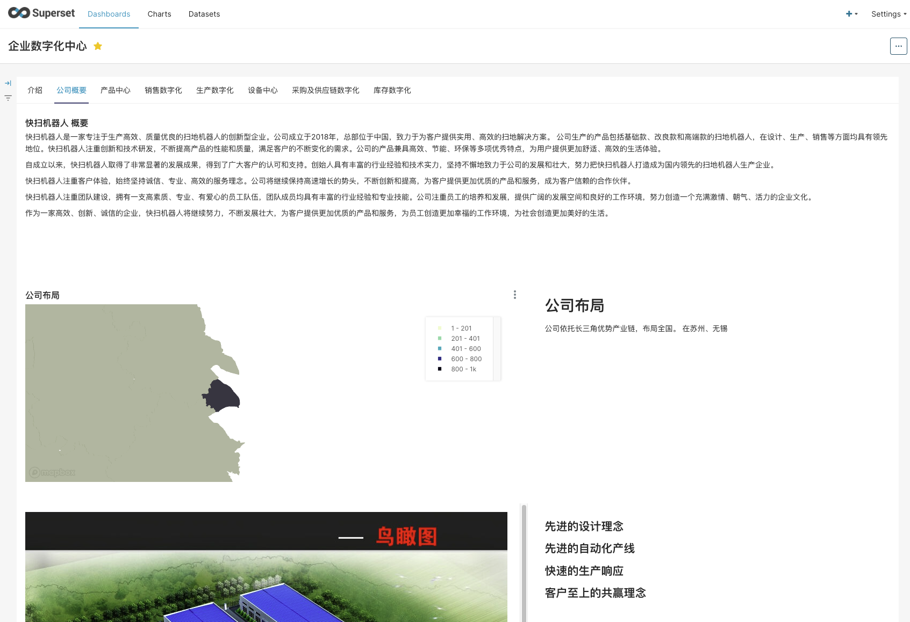
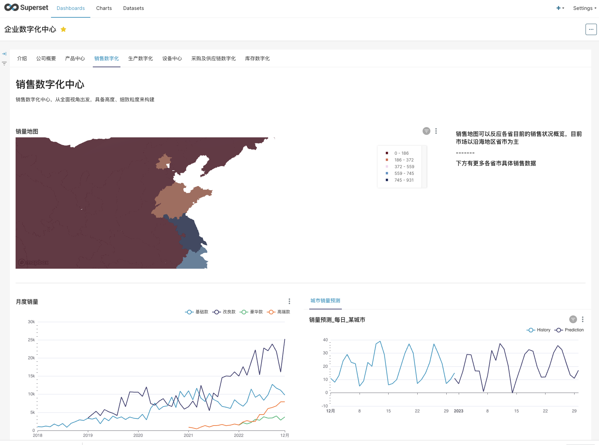
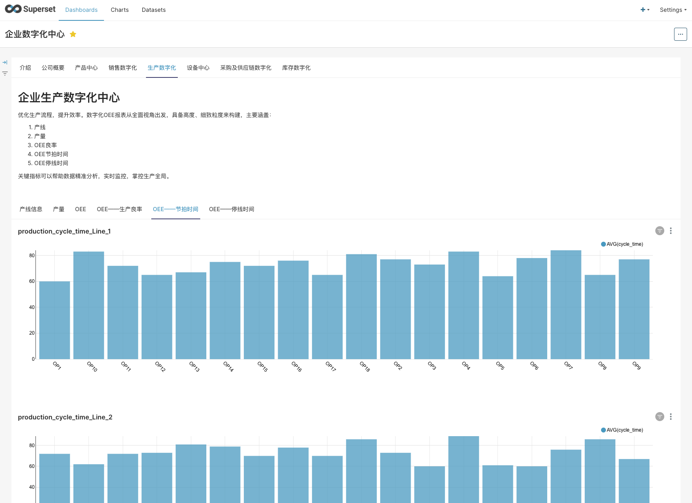

# MFG Operation Simulation Model

An operation model (demo) and manufacturing digitalization concepts for manufacturing companies. 

# MFG Models

### Manufacturing model including

1. basic information
1. bom and production design
1. production plan
1. sales data and forecast
1. inventory
1. purchase
1. production
1. equipment and maintenance

### Data
Around 20 demo data tables generated by certain rules.
Listed in 'generated'

# Dashbord with Opensource free BI Tools

And a demo dashboard with Superset for data visualization.

###  Further development
python 3.11

### Dashboard with Superset

## demo Link
http://43.137.10.2:8088/superset/welcome/

Login required with guest/guest

## Contribution

[MarcusChanCZY](https://github.com/MarcusChanCZY)
zhiyun as Admin

# A front-end with vite

ref
https://github.com/ychengcloud/react-vite-admin/tree/main

# run project
